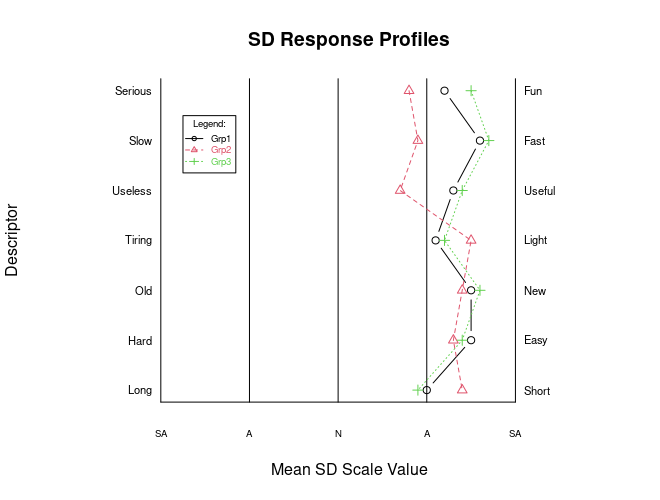

## sdRplot.R
(**Note: An `R` package for this funtion is at [`sdRgraph`](https://github.com/justineuro/sdRgraph).**)  

An [**R**](https://svn.R-project.org/R/) function than can be used for creating ***semantic differential*** (SD) inventory plots (see [Wikipedia: Semantic differential](https://en.wikipedia.org/wiki/Semantic_differential) for more info) .

You may have to change some of the graphing parameters, as the need arises, to get better quality plots.

This directory includes:

* [sdRplot.R](./sdRplot.R) - the [**R**](https://svn.R-project.org/R/) script for creating SD plots (raw source at [sdRplot.R](https://raw.githubusercontent.com/justineuro/sdRplot/master/sdRplot.R))
* [sdRplot-withExamples.R](./sdRplot-withExamples.R) - the [**R**](https://svn.R-project.org/R/) script with two examples (raw source at [sdRplot-withExamples.R](https://raw.githubusercontent.com/justineuro/sdRplot/master/sdRplot-withExamples.R))
* [sdRplot-withExamples.html](http://justineuro.github.io/sdRplot/sdRplot-withExamples.html) - a [**knitr**](http://yihui.name/knitr/)-generated output of the two examples given in the latter part of the script (HTML source at [sdRplot-withExamples.html](./sdRplot-withExamples.html)).  Note that when you source [sdRplot-withExamples.R](./sdRplot-withExamples.R) on the `R` console, only the plot from the second example (single profile) will usually appear on your graphics device unless you set your graphics device to draw two plots on one page, e.g., by using `par(mfrow=c(2,1))`.
  
  
 sdRplot by <a xmlns:cc="http://creativecommons.org/ns#" href="https://github.com/justineuro/" property="cc:attributionName" rel="cc:attributionURL">Justine Leon A. Uro</a> is licensed under a <a rel="license" href="http://creativecommons.org/licenses/by/4.0/">Creative Commons Attribution 4.0 International License</a>. Based on a work at <a xmlns:dct="http://purl.org/dc/terms/" href="https://github.com/justineuro/sdRplot" rel="dct:source">https://github.com/justineuro/sdRplot</a>.
