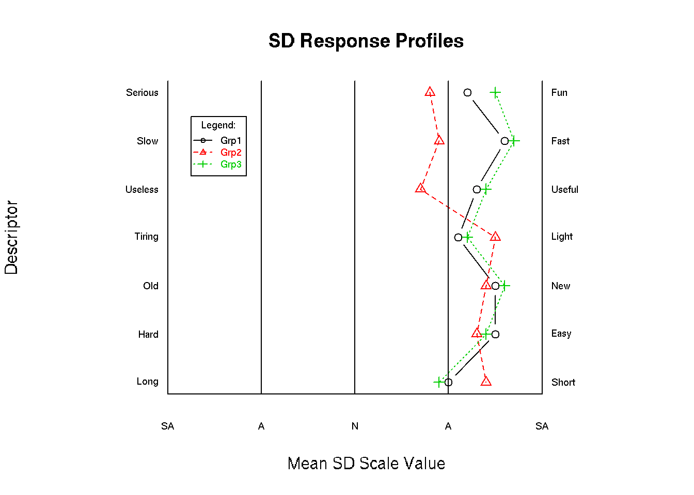

## sdRplot.R
An [**R**](https://svn.R-project.org/R/) function than can be used for creating ***semantic differential*** (SD) inventory plots (see [Wikipedia: Semantic differential](https://en.wikipedia.org/wiki/Semantic_differential) for more info) .

You may have to change some of the graphing parameters, as the need arises, to get better quality plots.

This directory includes:

* [sdRplot.R](./sdRplot/index.md) - the [**R**](https://svn.R-project.org/R/) script (raw source at [sdRplot.R](https://raw.githubusercontent.com/justineuro/sdRplot/master/sdRplot.R))
* [sdRplot.html](http://justineuro.github.io/sdRplot/sdRplot.html) - a [**knitr**](http://yihui.name/knitr/)-generated output of the example in the script (HTML source at [sdRplot.html](https://github.com/justineuro/sdRplot/blob/master/sdRplot.html))

 sdRplot by <a xmlns:cc="http://creativecommons.org/ns#" href="https://github.com/justineuro/" property="cc:attributionName" rel="cc:attributionURL">Justine Leon A. Uro</a> is licensed under a <a rel="license" href="http://creativecommons.org/licenses/by/4.0/">Creative Commons Attribution 4.0 International License</a>. Based on a work at <a xmlns:dct="http://purl.org/dc/terms/" href="https://github.com/justineuro/sdRplot" rel="dct:source">https://github.com/justineuro/sdRplot</a>.
